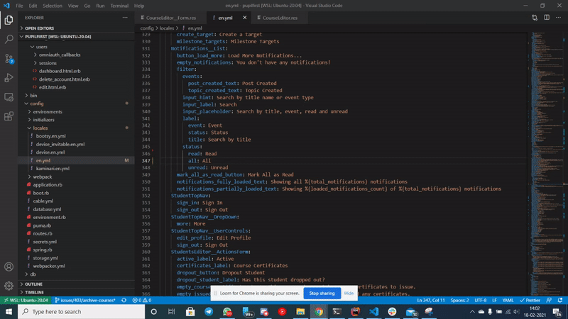

[](./LICENSE.md)

# pupilfirst-translator

Experimental plugin to set keys in I18n Yaml file

## Requirements

Open settings and add the following key

```
  "pupilfirst.translation.path": "add_absolute_path_to_your_en_yml_file",
```

## Examples

### Pupilfirst Translate


### Pupilfirst Order Translations


